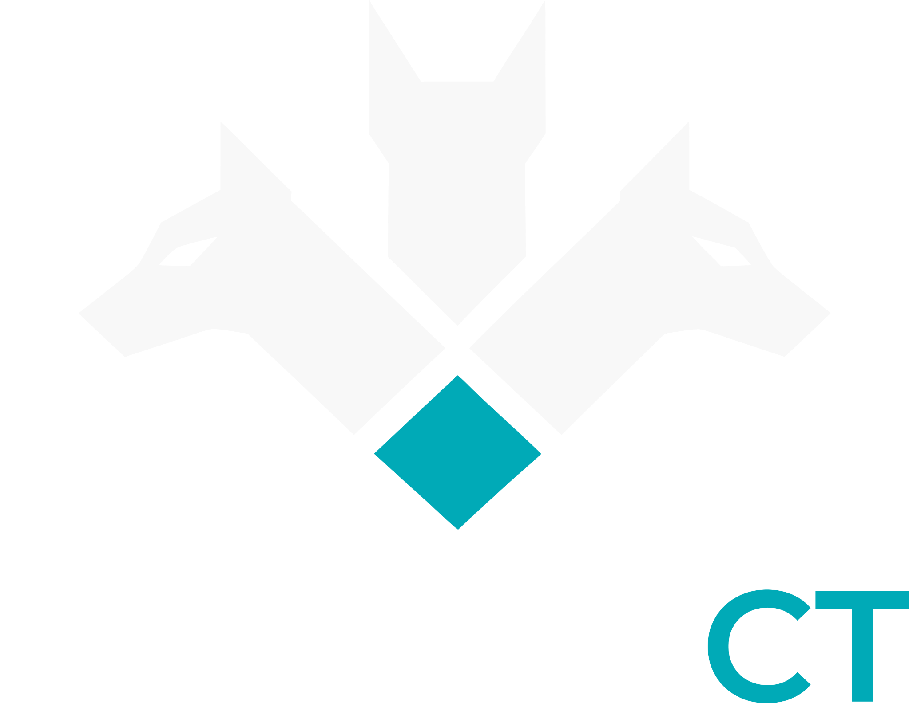
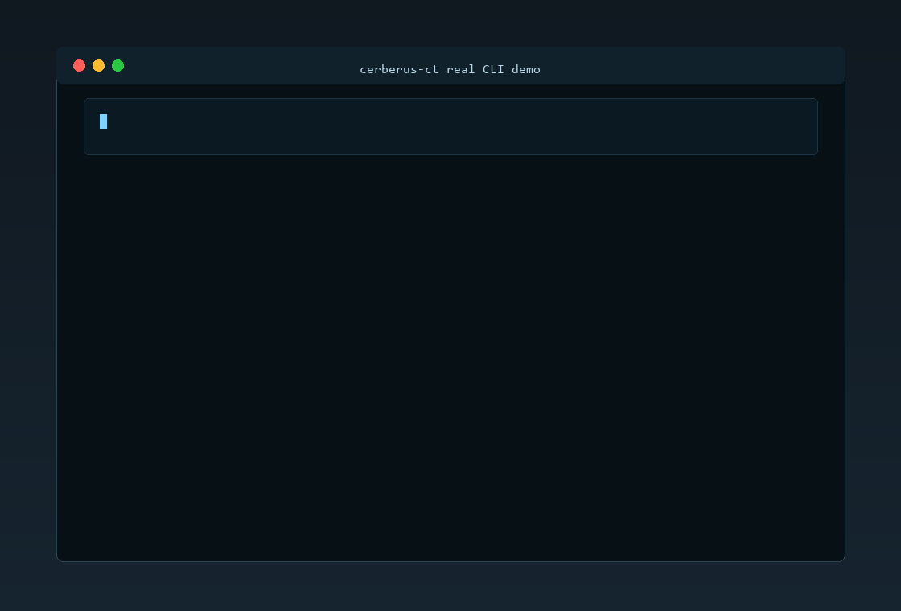

<p align="center">
  
</p>

<p align="center">
  <strong>Static CT Phishing &amp; DNS Exposure Sentinel</strong>
</p>

<p align="center">
  
  
  
  
  
</p>

<p align="center">
  Cerberus CT is a Rust security tool that monitors Static Certificate Transparency logs, parses certificate events, detects suspicious domains, enriches findings with DNS evidence, and reports phishing or DNS exposure signals as structured alerts.
</p>

## Overview

Cerberus CT helps security teams and researchers turn public Certificate Transparency data into useful monitoring signals.

Every publicly trusted TLS certificate is logged in Certificate Transparency. That makes CT logs one of the earliest public places where phishing domains, brand abuse domains, suspicious login portals, and exposed DNS patterns can appear. The challenge is that raw CT data is large, noisy, and not directly useful for day to day monitoring.

Cerberus CT watches Static CT logs, extracts domains from newly observed certificates, applies phishing and brand abuse detection rules, enriches alerts with DNS context, and can report potential subdomain takeover candidates when DNS points to risky external services.

The project is built as a Rust workspace with a reusable core crate and a command line interface.

## Why Static CT matters now

Certificate Transparency monitoring is moving toward Static CT. Let’s Encrypt announced that its RFC 6962 CT logs become read only on November 30, 2025 and shut down on February 28, 2026, with future writes going to Static CT logs.

This matters because many older CT monitoring workflows were designed around RFC 6962 style APIs or stream aggregators. Static CT uses checkpoint and tile based ingestion. Tools that cannot fetch checkpoints, calculate tile paths, decode tile entries, and resume from a known entry position are not well suited for this newer monitoring model.

Cerberus CT is built around this shift. It fetches Static CT checkpoints and data tiles directly, decodes certificate entries, extracts certificate domains, and turns them into explainable security findings.

## The problem

Attackers often prepare infrastructure before a campaign is visible to users. A certificate may appear for a suspicious domain before the domain is used in phishing emails, fake login pages, wallet theft campaigns, or brand abuse infrastructure.

Examples of domains defenders may want to notice early include:

```text
paypa1-login.com
microsoft-reset-auth.example
secure-wallet-verify.example
xn--example-punycode.test
```

Raw CT logs can expose these names early, but using them effectively is difficult.

| Problem | Why it matters |
| --- | --- |
| CT data is noisy | Most certificates are legitimate and not relevant to a brand or security team |
| Static CT is tile based | Monitoring requires checkpoint parsing, tile path calculation, and tile decoding |
| Domain signals are weak alone | A keyword like support is common, but stronger when combined with brand, DNS, or typosquat evidence |
| DNS context changes risk | A suspicious domain that resolves, fails to resolve, or points through a CNAME chain tells a different story |
| Repeated scans create duplicates | Long running monitoring needs state and deduplication |
| Alerts need automation | Security workflows need JSON and webhook output, not only terminal text |

## What Cerberus CT solves

Cerberus CT turns Static CT data into structured and explainable alerts.

```text
Static CT checkpoint
  to data tile
  to certificate event
  to domain observation
  to detection finding
  to DNS enrichment
  to grouped alert
  to JSON or webhook output
```

It helps defenders answer practical questions:

| Question | Cerberus CT output |
| --- | --- |
| Did a suspicious domain appear in CT logs | Domain findings from decoded certificate events |
| Does the domain look like a brand abuse attempt | Brand, keyword, typosquat, and homoglyph evidence |
| Does the domain resolve | DNS resolved status and IP evidence |
| Is there a CNAME chain | DNS CNAME evidence |
| Is there a possible dangling provider target | Conservative takeover candidate finding |
| Have I already alerted on this domain | Persistent watch state and dedupe |
| Can I send this to another system | JSON and webhook output |

Cerberus CT does not replace manual investigation. It gives early, structured, explainable signals that can feed a security workflow.

## Architecture

<p align="center">
  
</p>

The pipeline is designed around clear stages.

| Stage | Purpose |
| --- | --- |
| Static CT client | Fetches checkpoints and tiles from Static CT logs |
| Tile planner | Calculates data tile paths from checkpoint size |
| Tile fetcher | Downloads Static CT tile bytes |
| Data tile decoder | Decodes tile entries into certificate payloads |
| X.509 parser | Extracts SAN domains and certificate metadata |
| Detection engine | Runs keyword, brand, typosquat, and homoglyph detectors |
| DNS enrichment | Adds IP and CNAME evidence |
| Takeover candidate detector | Flags conservative DNS exposure candidates |
| Alert grouper | Combines findings by domain and applies rule filters |
| Output layer | Prints JSON, human output, or sends webhooks |
| Watch state | Tracks progress and deduplicates repeated alerts |

## Features

| Area | Capabilities |
| --- | --- |
| Static CT | Checkpoint fetch, tile path planning, tile fetch, data tile decode |
| Certificate parsing | PEM and DER parsing, SAN extraction, certificate event creation |
| Detection | Keyword, brand, typosquat, homoglyph, composition, punycode signals |
| DNS | Optional IP lookup, CNAME collection, DNS error evidence |
| Exposure | Conservative subdomain takeover candidate detection |
| Output | Human output, JSON output, grouped alerts, webhook delivery |
| Monitoring | Persistent watch mode with local JSON state |
| Rules | Minimum score filtering and suffix allowlisting |

## 30-second demo



```bash
cargo run -q -p cerberus-cli -- scan-domain paypa1-login.com paypal-secure-login.com --config examples/demo_config.yaml --format json --grouped --summary
```

The demo GIF is rendered from a real local CLI run. It shows grouped critical alerts with composition, homoglyph, keyword, brand, and typosquat evidence. See `docs/demo/` for the condensed sample output and asciinema cast source.

## Releases

Tagged releases build precompiled `cerberus` binaries for Linux x86_64, Windows x86_64, macOS x86_64, and macOS ARM64 through the release workflow. Source builds are still supported with Cargo.

For an existing tag, run the `Release Binaries` workflow manually and pass the tag name.

## Project structure

```text
cerberus-ct/
  crates/
    cerberus-core/
      data/
    cerberus-cli/
  docs/
  examples/
  scripts/
  tests/
```

`cerberus-core` contains the reusable library logic.

`cerberus-cli` contains the command line interface.

## Build and test

```bash
cargo fmt --check
cargo check --workspace
cargo test --workspace
cargo clippy --workspace --all-targets -- -D warnings
```

## Configuration modes

Cerberus CT can be used with different rule profiles.

| Config | Purpose |
| --- | --- |
| `examples/basic_config.yaml` | Realistic low noise monitoring config |
| `examples/demo_config.yaml` | Demo and testing config that keeps visible low signal alerts |

Use `basic_config.yaml` for realistic monitoring. It can suppress trusted infrastructure such as Microsoft, Amazon, AWS, Google, GitHub, and PayPal suffixes.

Use `demo_config.yaml` when you want predictable demo output from known CT tiles. The checked-in configs include trusted Static CT log metadata for Let's Encrypt Sycamore shards used by the examples.

## Quick start

Scan a manual domain.

```bash
cargo run -p cerberus-cli -- scan-domain paypa1-login.com --config examples/basic_config.yaml --format json --grouped --summary
```

Scan one real Static CT data tile with demo rules.

```bash
cargo run -p cerberus-cli -- scan-ct https://mon.sycamore.ct.letsencrypt.org/2026h2/ --index 0 --config examples/demo_config.yaml --format json --grouped --summary
```

Run one watch cycle from a seeded tile.

```bash
cargo run -p cerberus-cli -- watch-ct https://mon.sycamore.ct.letsencrypt.org/2026h2/ --config examples/demo_config.yaml --state .cerberus/demo-state.json --reset-state --seed-index 0 --once --format json --grouped --summary
```

Enable DNS enrichment.

```bash
cargo run -p cerberus-cli -- scan-domain paypa1-login.com --config examples/basic_config.yaml --format json --grouped --summary --dns
```

Enable takeover candidate checks.

```bash
cargo run -p cerberus-cli -- scan-ct https://mon.sycamore.ct.letsencrypt.org/2026h2/ --index 0 --config examples/basic_config.yaml --format json --grouped --summary --takeover
```

Suppress low signal findings.

```bash
cargo run -p cerberus-cli -- scan-ct https://mon.sycamore.ct.letsencrypt.org/2026h2/ --index 0 --config examples/demo_config.yaml --format json --grouped --summary --min-score 50
```

Suppress trusted infrastructure by suffix.

```bash
cargo run -p cerberus-cli -- scan-ct https://mon.sycamore.ct.letsencrypt.org/2026h2/ --index 0 --config examples/demo_config.yaml --format json --grouped --summary --allowlist-suffix console.aws.amazon.com
```

## Webhook test

Start the local webhook receiver.

```bash
python examples/webhook_receiver.py
```

Send a grouped alert to it.

```bash
cargo run -p cerberus-cli -- scan-domain paypa1-login.com --config examples/basic_config.yaml --format json --grouped --webhook-url http://127.0.0.1:8787/webhook
```

You can also use an environment variable.

```bash
export CERBERUS_WEBHOOK_URL=http://127.0.0.1:8787/webhook
cargo run -p cerberus-cli -- scan-domain paypa1-login.com --config examples/basic_config.yaml --format json --grouped
```

PowerShell users can use this form.

```powershell
$env:CERBERUS_WEBHOOK_URL="http://127.0.0.1:8787/webhook"
cargo run -p cerberus-cli -- scan-domain paypa1-login.com --config examples/basic_config.yaml --format json --grouped
Remove-Item Env:CERBERUS_WEBHOOK_URL
```

Set `outputs.webhook_signing_secret` to add `X-Cerberus-Timestamp` and `X-Cerberus-Signature` headers. The signature is HMAC-SHA256 over `timestamp.payload`, formatted as `sha256=<hex>`.

## Example grouped alert

```json
{
  "summary": {
    "domain_count": 1,
    "finding_count": 2,
    "alert_count": 1,
    "message": "1 grouped alert produced"
  },
  "alerts": [
    {
      "domain": "paypa1-login.com",
      "severity": "critical",
      "score": 97,
      "detectors": [
        "keyword",
        "typosquat"
      ],
      "reasons": [
        "domain contains suspicious keyword `login`",
        "domain label candidate `paypa1` is edit-distance 1 from `paypal`"
      ]
    }
  ]
}
```

## Example clean summary

```json
{
  "summary": {
    "tile": {
      "kind": "data",
      "level": null,
      "index": 3582048,
      "width": 198,
      "path": "tile/data/x003/x582/048.p/198",
      "url": "https://mon.sycamore.ct.letsencrypt.org/2026h2/tile/data/x003/x582/048.p/198",
      "byte_len": 403733
    },
    "entry_count": 198,
    "event_count": 198,
    "parse_error_count": 0,
    "finding_count": 0,
    "alert_count": 0,
    "message": "No matching alerts for current rules"
  },
  "alerts": []
}
```

## Example configuration

```yaml
brands:
  - paypal
  - microsoft
  - github

official_domains:
  - paypal.com
  - microsoft.com
  - github.com

keywords:
  - login
  - secure
  - support
  - wallet
  - verify
  - reset

allowlist: []

outputs:
  webhook_url: null
  webhook_signing_secret: null
  slack_webhook_url: null

dns:
  enabled: false
  takeover: false
  concurrency: 16

ct:
  trusted_logs:
    - origin: log.sycamore.ct.letsencrypt.org/2026h2
      base_url: https://mon.sycamore.ct.letsencrypt.org/2026h2/
      log_id: bP5QGUOoXqkWvFLRM+TcyR7xQRx9JYQg0XOAnhgY6zo=
      public_key: |
        -----BEGIN PUBLIC KEY-----
        MFkwEwYHKoZIzj0CAQYIKoZIzj0DAQcDQgAEwR1FtiiMbpvxR+sIeiZ5JSCIDIdT
        APh7OrpdchcrCcyNVDvNUq358pqJx2qdyrOI+EjGxZ7UiPcN3bL3Q99FqA==
        -----END PUBLIC KEY-----

rules:
  min_score: 0
  allowlist_suffixes: []
```

## Main commands

| Command | Purpose |
| --- | --- |
| `scan-domain` | Scan one or more manual domains |
| `demo-watch` | Run the mock CT source |
| `validate-config` | Validate a YAML config file |
| `fetch-checkpoint` | Fetch and parse a Static CT checkpoint |
| `fetch-tile` | Fetch a Static CT tile |
| `fetch-events` | Decode certificate events from a data tile |
| `scan-ct` | Scan one Static CT data tile |
| `watch-ct` | Run persistent Static CT monitoring |

## Detection model

Cerberus CT produces explainable findings. Each finding includes a detector name, severity, score, reasons, and evidence.

Grouped alerts combine multiple findings for the same domain. A domain that matches both keyword and typosquat logic receives a higher final score than a domain that only matches one low signal rule.

## Rule quality

Cerberus CT includes rule quality controls because CT monitoring is naturally noisy.

| Control | Purpose |
| --- | --- |
| `rules.min_score` | Suppress low score findings |
| `rules.allowlist_suffixes` | Suppress trusted domains and their subdomains |
| `official_domains` | Prevent protected brand domains from being treated as abuse |
| `allowlist` | Suppress exact domains |

This makes it possible to keep high visibility during testing while reducing noise in realistic monitoring.

## Takeover candidate policy

Takeover output is intentionally conservative.

Cerberus CT reports candidates when DNS evidence suggests a CNAME points at a known external provider and the target does not resolve as an active service. It does not claim confirmed takeover or exploitation.

Always validate takeover findings manually before action.

## Limitations

| Limitation | Notes |
| --- | --- |
| Heuristic detection | Findings are signals, not final verdicts |
| DNS dependency | DNS output can change over time |
| Provider fingerprints | Takeover rules need ongoing maintenance |
| CT freshness | Latest tiles may return no matching alerts |
| Webhook delivery | Watch mode uses a durable local outbox with at-least-once delivery, so receivers should dedupe |
| Live services | Resolved third party CNAMEs are treated as enrichment, not takeover evidence |
| Demo output | Demo commands should use `examples/demo_config.yaml` |

## Documentation

| File | Content |
| --- | --- |
| `docs/architecture.md` | Core architecture and pipeline |
| `docs/usage.md` | Command examples |
| `docs/detection_model.md` | Detection and scoring model |
| `docs/limitations.md` | Known limitations |

## Status

Cerberus CT is at MVP stage. It is suitable for learning, demonstrations, research workflows, and early security monitoring experiments.

## License

This project is licensed under the repository license.
