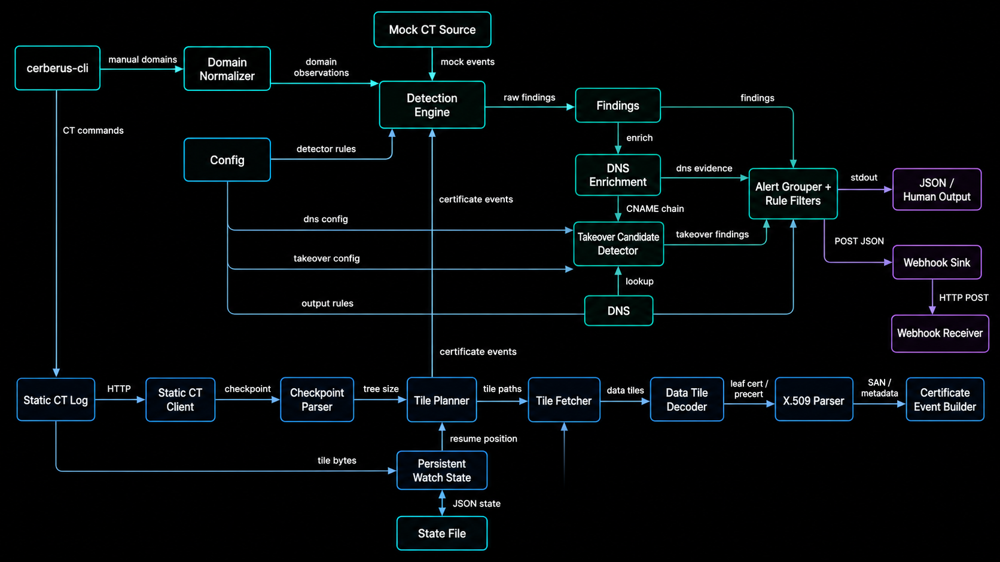

# Architecture

Cerberus CT is split into a reusable core library and a thin CLI wrapper.

```text
cerberus-ct/
  crates/
    cerberus-core/
    cerberus-cli/
```


## Diagram

<p align="center">
  
</p>

## Core pipeline

```text
Static CT checkpoint / tiles
→ tile fetch
→ data tile decode
→ certificate parsing
→ SAN domain extraction
→ domain normalization
→ detection engine
→ DNS enrichment / takeover candidate checks
→ findings
→ grouped alerts
→ output sinks
```

## Core modules

```text
config/     project configuration and runtime rule overrides
ct/         Static CT checkpoint, tile, decoder, and source logic
cert/       PEM/DER certificate parsing and event conversion
domain/     domain normalization and domain types
detect/     keyword, brand, typosquat, and homoglyph detectors
dns/        DNS enrichment and takeover candidate checks
output/     JSON/webhook payload models and sinks
state/      persistent watch state and dedupe
score/      alert scoring helpers
```

## CLI responsibilities

The CLI is intentionally thin. It parses arguments, loads config, calls `cerberus-core`, and prints or sends results.

Main commands:

```text
scan-domain       scan one or more domains directly
demo-watch        run mock CT watch mode
validate-config   validate YAML config
fetch-checkpoint  fetch a Static CT checkpoint
fetch-tile        fetch a Static CT tile
fetch-events      decode events from a Static CT data tile
scan-ct           scan one Static CT data tile
watch-ct          persistent Static CT monitoring
```

## State model

`watch-ct` uses a local JSON state file to track:

```text
log URL
last checkpoint size
last checkpoint root hash
last scanned tile index
last scanned entry index
alerted finding identities
dead-letter parse errors
pending outbox events
```

This prevents repeat scanning and duplicate alerts in normal monitoring mode, and lets webhook delivery resume after transient failures.
