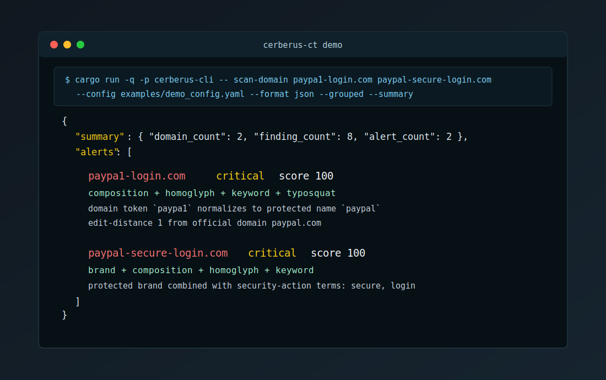

# 30-second demo

This demo is meant for the first GitHub scroll: one command, two suspicious domains, multiple explainable signals.



Run the same scenario locally:

```bash
cargo run -q -p cerberus-cli -- scan-domain paypa1-login.com paypal-secure-login.com --config examples/demo_config.yaml --format json --grouped --summary
```

Artifacts:

| File | Purpose |
| --- | --- |
| `sample-alert-summary.json` | Condensed JSON output for quick inspection |
| `cerberus-demo.cast` | Asciinema v2 cast source |
| `../assets/demo-terminal.svg` | GitHub-rendered terminal screenshot |

To turn the cast into an animated GIF, install an asciinema renderer such as `agg` and run:

```bash
agg docs/demo/cerberus-demo.cast docs/demo/cerberus-demo.gif
```
